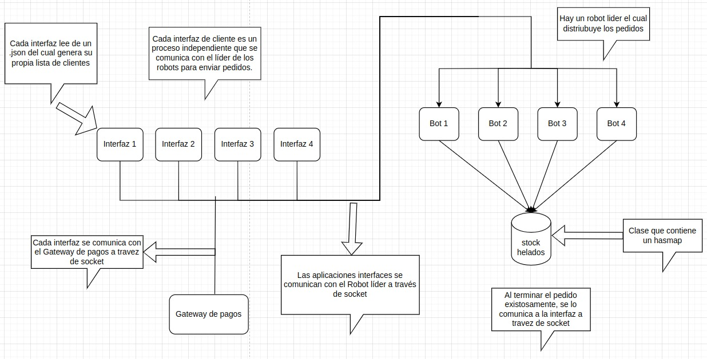
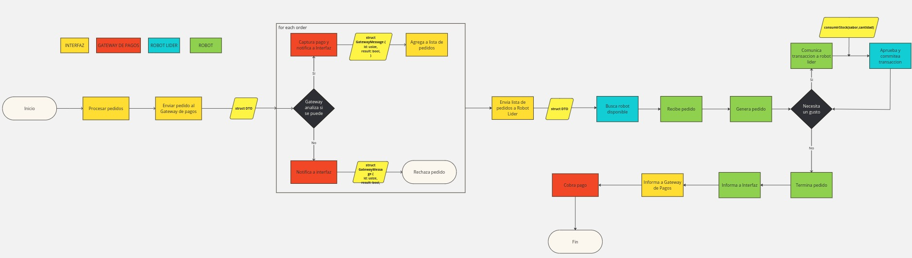
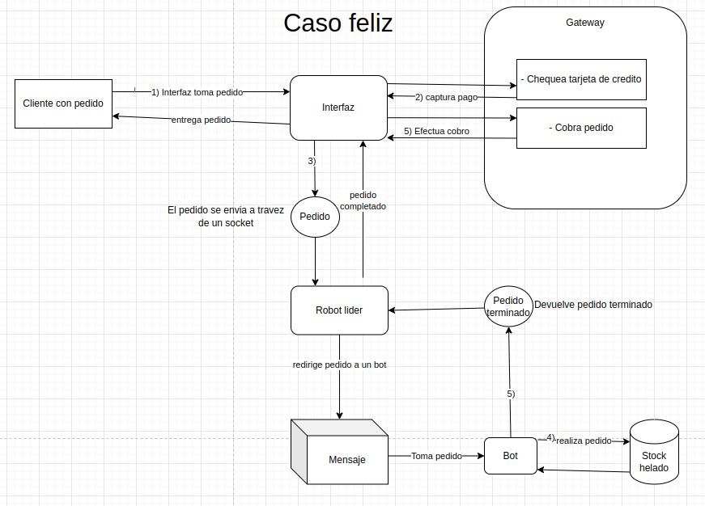
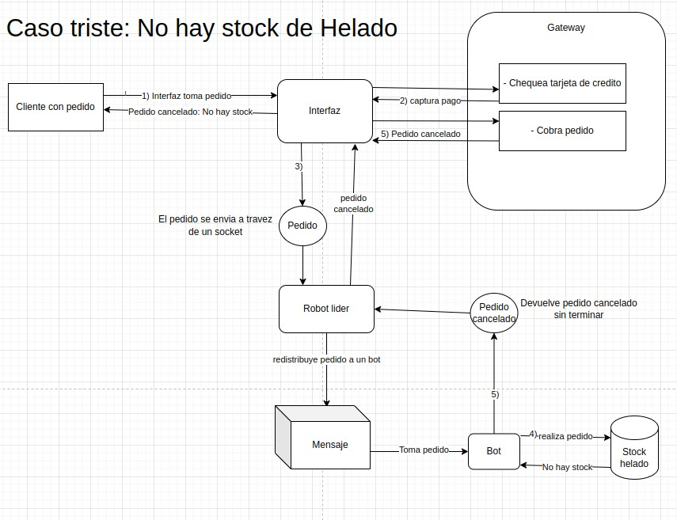
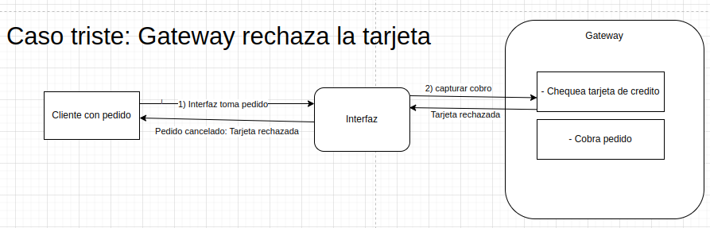
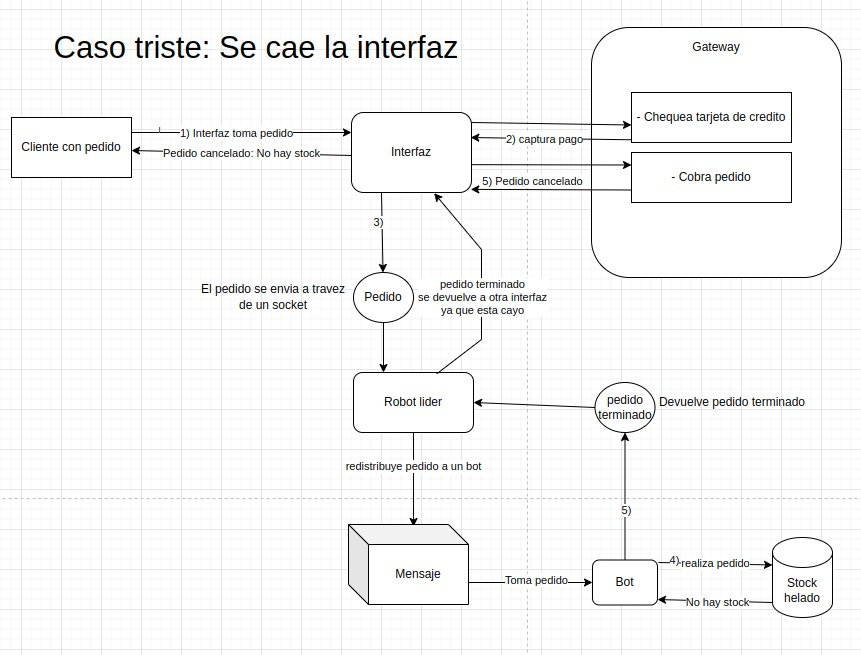

[](https://classroom.github.com/a/PKo6zpFB)

|Nombre y Apellido | Padron |
|----------------- | ------ |
|José chavez Cabanillas| 96467|
|Mateo Lardiez| 107992 |
|Mauricio Davico| 106171 |

- [Ejecucion](#ejecucion)
- [Explicacion de diseño](#explicacion-de-diseño)
  - [Interfaces con Clientes (Procesos)](#interfaces-con-clientes-procesos)
  - [Robots (Procesos y Actores)](#robots-procesos-y-actores)
  - [Líder de Robots](#líder-de-robots)
  - [Stock de helados](#stock-de-helados)
  - [Gateway de pagos](#gateway-de-pagos)
  - [Comunicación](#comunicación)
- [Protocolo de comunicación](#protocolo-de-comunicación)
  - [Estructura](#estructura)
- [Supuestos (desiciones tomadas para la implementacion)](#supuestos-desiciones-tomadas-para-la-implementacion)
- [Puertos](#puertos)
- [Precios](#precios)
- [Como hacer el sistema resiliente](#como-hacer-el-sistema-resiliente)
  - [Caida de Interfaz](#caida-de-interfaz)
  - [Caida de robot lider](#caida-de-robot-lider)
  - [Caida de robot](#caida-de-robot)
  - [No hay stock de helado](#no-hay-stock-de-helado)


# Video de entrega final
https://drive.google.com/drive/folders/13xSzEOnj-RUsV_Ip-kwhwKb-a88C5Gz6?usp=sharing

# Ejecucion:
  Para la ejecucion de la heladeria se deben ejecutar al menos 4 terminales y en el siguiente orden, parandose en la carpeta target/debug/:
  - Terminal del Gateway:
  ```bash
  ./terminal_gateway
  ```
  - Terminal de robot:
   
  ```bash
  ./terminal_robot <ID> .
  ```
  
  Se ejecutan los N robots que se quieran. Ej: ./terminal_robot 1 (terminal para robot 1). Se deben ejecutar al menos 2 robots. Uno que sea Robot Lider y otro que sea un robot normal
   
  - Terminal de interfaz:
  
  ```bash
   ./terminal_interface <ID> <PATH-TO-FILE_ORDERS>>
  ```
  Se ejecutan las N interfaces que se quieran. Ej: ./terminal_interface 1 ../../orders/orders1.json 
  
  Una vez que ejecutamos las 3 terminales, comienza el flujo de la heladeria, comunicandose la interfaz con el gateway, luego con el robot pasandole los pedidos, luego el robot le comunica si realizo el pedido y finalmente la interfaz se vuelve a comunicar con el gateway para realizar el cobro del helado. 

  La otra forma de ejecucion es muy similar a la anterior, respetando el order de ejecución mencionado anteriormente, los comandos serian los siguientes:

  ```bash
    cargo run --bin terminal_gateway
    cargo run --bin terminal_robot <ID>
    cargo run --bin terminal_interface <ID> <PATH-TO-FILE-ORDERS>
  ```

# Explicacion de diseño

Para el diseño de nuestra heladeria tomamos los siguientes lineamientos:

## Interfaces con Clientes (Procesos y Actores)

- Cada interfaz de cliente es un proceso independiente que actua como un actor y se comunica con el líder de los robots para enviar pedidos. 
- Estas leen su archivo de clientes (un .json) generan ordenes de pedido.

## Robots (Procesos y Actores)

- Cada robot es un proceso independiente y actúa como un actor que puede recibir mensajes de trabajo.
- Se selecciona uno de esos actores como lider y este es el que distribuye los pedidos entre robots.
- Si por alguna razon este cae, se selecciona un nuevo lider a traves del metodo de anillo.
- Los robots se comunican a través de sockets, usando los handlers de mensajes de actores.

## Líder de Robots

- El líder de robots es responsable de recibir pedidos de las interfaces y distribuirlos a los robots que estén disponibles. 
- Mantiene un estado de disponibilidad de los robots. Si estan todos los robots ocupados, el mensaje de pedido queda en espera hasta que algun robot se libere. 
- El robot lider acepta un pedido a la vez y si lo puede distribuir a algun robot libre, recien ahi acepta otro pedido

## Stock de helados

Se utiliza un sistema de transacciones distribuidas de dos fases para gestionar el acceso al stock de cada uno de los gustos de helados, ya que son recursos que necesitamos que se accedan de a un robot a la vez. Cada vez que un robot quiere generar un pedido accediendo al stock de un gusto de helado, se considera como una transaccion la cual tiene multiples operaciones como verificar el stock y consecuentemente actualizar el stock. 

Si un robot quiere hacer un pedido de 3 gustos de helado, debe hacer 3 transacciones, una para acceder al stock de cada gusto de helado. Acceder al stock de un gusto de helado no bloquea el acceso a acceder al stock de otro gusto de helado. Se elije hacer de esta manera ya que de esta forma se generan pedidos de forma concurrente.

El robot lider es el unico robot que puede acceder al stock de helados. El stock de un helado esta representado por una clase IceCreamContainter la cual contiene un Arc<Mutex<f64>> el cual representa el stock del helado. El robot lider contiene un HashMap de clave String (nombre del tipo de helado), IceCreamContainer (stock de ese helado). Cuando el robot recibe la transaccion para utilizar el stock, intenta acceder y luego utilizarlo. Si hay suficiente stock lo realiza, sino envia un mensaje de que no hay suficiente stock

## Gateway de pagos

El gateway de pagos será responsable de gestionar las transacciones del pago. Las interfaces de clientes se comunicarán con el gateway mediante sockets. Este captura el pago al momento de realizar el pedido, y el realiza el cobro efectivo al momento de entrega, o bien su cancelación. La interfaz hace el calculo del precio del pedido. Si el cliente no tiene saldo suficiente, le comunica esto a la interfaz. Tambien tiene una posibilad del 10% de que falle aleatoriamente, cancelando el pedido

## Comunicación

Sockets: Se utilizan para la comunicación entre procesos:
    - Las interfaces y el lider de robots
    - Las interfaces y el Gateway
    - Los robots entre si
En ningun momento es bloqueante la comunicacion a traves de sockets, ya que por cada comunicacion entre la interfaz y un robot se lanza un nuevo thread que espera su respuesta. Tambien se utilizan sockets Udp.
Para el caso de comunicacion entre los robots, el robot lider envia los pedidos pero no espera respuesta por lo que no se bloquea, se asigna un pedido y lo procesa.

Actores: Dentro del proceso del líder de robots y los procesos de los robots, usamos un modelo de actores para manejar la concurrencia. Las interfaces tambien son actores.

El flujo de trabajo que pensamos es el siguiente:


Para un diagrama de flujo mas especifico tambien esta el siguiente:


- Las interfaces leen un archivo json y generan una lista de pedidos y las procesan de la siguiente manera:
- Se desencola un pedido de la lista de pedidos generada previamente.
- Se genera el costo del pedido.
- Se envia al Gateway de pagos el pedido, el cual chequea si el cliente tiene saldo suficiente. Si es asi, se captura el pago; sino le devuelve a la interfaz que no hay saldo suficiente y la interfaz cancela el pedido. Tambien puede fallar alteatoriamente con una probabilidad del 10%
- Se envía la orden de pedido al robot lider a traves de socket. Abre un nuevo thread para esperar la respuesta
- El Robot lider se lo asigna al primer robot disponible que encuentre (El robot tiene un estado Disponible u Ocupado). Si no hay robot disponible en ese momento, el mensaje queda en espera hasta que se libere un robot (es decir, cuando un robot termina de procesar un pedido, le informa su estado al lider de robots para que eventualmente el lider le pueda asignar un nuevo pedido)
- Un robot hace la orden de ese pedido si es que hay stock y lo devuelve completo a la interfaz a traves de un socket conectado al puerto de esa interfaz. El robot cuando se libera, cambia su estado a Disponible (informando al lider de robots).
- Se entrega el pedido a la Interfaz, esta le comunica el estado del pedido al Gateway y este realiza el cobro o lo cancela según corresponda.

En la imagen se puede ver el proceso de un caso positivo del recorrido de un pedido:


Tambien podemos mostrar un caso negativo en el que no hay stock suficiente de helado:


- En caso de que no haya stock disponible, el robot que esta generando ese pedido lo "tira a la basura" y envia mensaje a la interfaz diciendo que no se completo el pedido. Por lo que la interfaz le comunica al Gateway que no cobre el pago

Otro caso negativo es cuando no hay suficiente dinero en la cuenta para pagar:


- La interfaz envia al Gateway el pedido y el Gateway le devuelve a la interfaz que no hay saldo suficiente, por lo que "tira el pedido". Este caso tambien aplica para cuando el Gateway falla de forma aleatoria

El diagrama de flujo de un pedido es el siguiente:


# Protocolo de comunicación

- Entre Interfaz y robot lider
Para el mismo se pensó usar un DTO (Data transfer Object) que contega la orden del Pedido, asi como también información de la interfaz desde la que fue enviada la orden de pedido. Con esto se busca que el Robot, al terminar de realizar la orden de pedido pueda enviar el pedido completado directamente a la interfaz a traves del socket, para poder librerarse y poder realizar el siguiente pedido

- Entre robot lider y robots
El robot lider le envia a los robots el DTO que contiene todos los datos para realizar el pedido. Tambien se comunican constantemente para saber quien es el lider y quien no. El lider conoce todos los robots que estan "vivos", y los robots conocen solo al lider. 

Para realizar un pedido de helado se comunican de la siguiente manera:
 - Robot lider tiene la lista de pedidos y la lista de robots con su estado (Disponible/Ocupado)
 - Los robots disponibles se quedan bloqueados esperando por un nuevo pedido
 - Cuando el lider detecta que hay un robot disponible, entonces le asigna un pedido a dicho robot enviandole un mensaje, este mensaje es el DTO de la orden. Luego empiezan las transacciones:
  - el robot pide el stock disponible de un sabor en particular al lider. Es una tarea bloqueante
  - El lider modifica ese stock en caso de que alcance para realizar la orden. Sino cancela la orden
  - Si llega otra orden de pedido del mismo sabor, el robot solicitante se quedara esperando el sabor que solicita hasta recibir una respuesta por parte del lider 

El mensaje de transaccion es del estilo:
UseStock:sabor,cantidad.
El lider chequea si se puede consumir esa cantidad de stock o no. Si se puede responde: StockResult:true o StockResult:false

Un robot puede quedarse bloqueado esperando a que el coordinador de transacciones (robot lider) procese su transaccion, pero no se va a quedar bloqueado infinitamente nunca por esta razon. Si 2 robots quieren usar el mismo stock de helado, el coordinador de transacciones ejecuta primero una transaccion y luego la otra

## Estructura

```Rust
pub struct Order {
    id: u32,
    id_client: u32,
    products: Vec<String>, // Sabores de helados
    amount: f32, // -> cantidad de productos por ejemplo 1/2kg
    total_price: f32,
    status: StatusOrder,
    card_cash: usize,
}
```

La estructura del DTO sería:

- Order
- id_interfaz

Entre Robot lider y robot
Se penso tambien un DTO el cual contenga la Order con id_interfaz 


# Supuestos (desiciones tomadas para la implementacion)

- Cada pedido de cliente del archivo de clientes contiene:
  - id de pedido
  - Nombre de cliente
  - Tamanio de pedido
  - Gustos
  - Cantidad de plata en tarjeta de credito
- 3 sabores por pedido como maximo para los 3 tipos de contenedores.
- 5 sabores posibles: [Dulce de leche, Chocolate, Frutilla, Vainilla, Crema americana]
- Cada sabor es repartido de manera equitativa dentro del pedido

> Ejemplo: Si se piden 2 sabores en $\frac{1}{4}$*Kg*, este pedido será despachado obteniendo un $\frac{1}{8}$*Kg* cada sabor del stock

- En caso de que se acaba un sabor de helado y los siguientes pedidos contengan ese sabor, los pedidos se van a cancelar, ya que van a querer acceder a ese stock y va a estar vacio.

- Para los pedidos:
  - La interfaz lee todos los pedidos del archivo y genera una lista. Luego chequea si hay saldo uno por uno con el Gateway. A medida que los aprueba le Gateway, los envia al Robot Lider. El Robot Lider debe encadenar este pedido en la lista de pedidos generales que ya tiene. Tambien los demas robots tienen una referencia a esa lista general de pedidos, por si cae ese robot lider, pero solo el robot lider es el que asigna los pedidos a los demas robots.
  - Para que las interfacez se comuniquen con el robot lider se utiliza un puerto por el cual solo el robot lider es el que escucha. Cuando cae el robot lider, el siguiente robot lider puede conectarse a ese puerto y las interfaces no hace falta que se enteren que cayo ese lider

- Para el stock:
  - Se tiene que implementar un sistema de transacciones distribuidas de dos fases para gestionar el acceso al stock de los helados, ya que es un recurso que necesitamos que se acceda de a un robot a la vez. Cada vez que un robot quiere generar un pedido accediendo al stock, se considera como una transaccion la cual tiene multiples operaciones como verificar el stock y consecuentemente actualizar el stock. El robot envia el sabor del helado y su stock que precisa al robot lider. El robot lider chequea si tiene stock, y si lo tiene reduce su tamanio y le comunica al robot que se pudo realizar ese pedido. El stock esta encapsulado en una clase particular (como ya se nombro mas arriba) cuyo atributo es un mutex. De esta manera se maneja cualquier tipo de problema de concurrencia (race condition, deadlock, busywait, etc)

# Puertos

Puerto de Gateway:
- 127.0.0.1:8080

Pueto de Interfaces:
- 127.0.0.1:{9000 + id}

Puerto de robot lider:
- 127.0.0.1: {5000}

Puerto de robots:
- 127.0.0.1:{6000 + id}


# Precios:
 - 1/4 (0.25) => 500
 - 1/2 (0.5) => 850
 - 1 (1) => 1500

# Como hacer el sistema resiliente

## Caida de Interfaz

En caso de que se caiga la interfaz luego de enviar el pedido al robot lider, se debe entregar de todas maneras. Entonces cuando el robot termina el pedido y quiere enviarlo al puerto de la interfaz, si nota que esta cerrado envia al puerto de la interfaz anterior (puerto interfaz - 1). Si este tambien esta cerrado envia al puerto de la interfaz siguiente (puerto interfaz + 1). Esto es asi porque los puertos de las interfaces son: nro_puerto + id_interfaz.
La interfaz envia los pedidos al Gateway para chequear que haya saldo suficiente y luego al Robot Lider. Una vez que el pedido se envio al Robot Lider, se va a poder completar de todas formas



## Caida de robot lider

Si el robot lider cae, se reelige otro robot lider a traves del algoritmo de anillo. Este robot lider conoce ya previamente la lista de pedidos y puede continuar el flujo como lider y asignar pedidos a los demas robots. Este se conecta al puerto del Robot Lider y continua con la ejecucion

## Caida de robot

Para manejar el problema en el que un robot que esta realizando un pedido se cae, en vez de que se pierda ese pedido, se penso la siguiente solucion:

Se tiene una lista de pedidos y una lista de pedidos_en_proceso. Cuando asigno un pedido a un robot, lo saco de la lista de pedidos y lo meto en la lista de pedidos_en_proceso. Cuando el robot termina el pedido, se lo comunica al robot lider y este lo saca de la lista de pedidos_en_proceso y se le comunica a la interfaz que el pedido ya esta listo para ser cobrado. El robot tiene un tiempo determinado para generar el pedido (lo suficientemente grande como para saber que esta bloqueado el robot y no esperando a acceder el stock de helados). Si el robot no termina el pedido en ese tiempo determinado, entonces el lider saca el pedido de la lista de pedidos_en_proceso y le pregunta al robot que estaba procesando el pedido el estado del mismo y si este no responde se asume que el robot no esta funcionando por lo tanto se retira de la lista de robots activos y el robot lider vuelve a pasar ese pedido de la lista de pedidos_en_proceso a la lista de pedidos, para que lo tome otro robot.

En caso de que el robot se caiga mientras tiene acceso al stock de helados, la transaccion va a a abortar y va a finalizar forzadamente la transaccion y restaurando los valores anteriores

## No hay stock de helado

Si cuando un robot esta realizando un pedido, se queda sin stock del helado que lleva ese pedido, le comunica a la interfaz que el pedido esta incompleto y busca otro pedido. El stock que se utilizo previamente en otras transacciones no se recupera.


